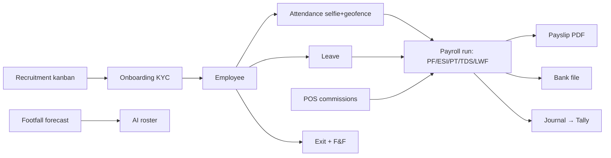

# Flow — HR & Payroll

```mermaid
flowchart LR
  REC[Recruitment kanban] --> ONB[Onboarding KYC] --> EMP[Employee]
  EMP --> ATT[Attendance selfie+geofence] --> PAY
  EMP --> LV[Leave] --> PAY
  POS[POS commissions] --> PAY[Payroll run: PF/ESI/PT/TDS/LWF]
  PAY --> SLIP[Payslip PDF] & BANK[Bank file] & JRN[Journal → Tally]
  FOOT[Footfall forecast] --> ROS[AI roster]
  EMP --> EXIT[Exit + F&F]
```

_Status: planned. Updated as built._
